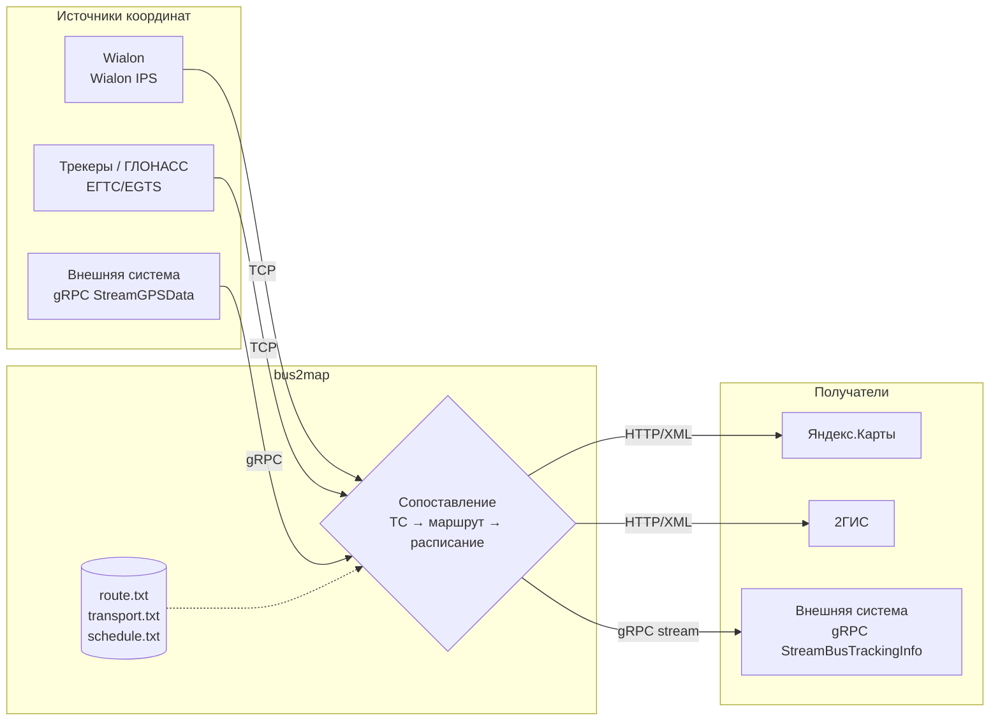

# bus2map

## Описание

**bus2map** — сервис, который принимает GPS-данные общественного транспорта от систем мониторинга (**Wialon**, **ЕГТС/EGTS**,
а также напрямую по **gRPC**), дополняет их данными о маршруте и расписании и передаёт в **"Яндекс.Карты"** и **"2ГИС"**
по протоколу реального времени.

Это переработанная на Go версия сервиса [Gps2Yandex](https://github.com/bars43ru/gps2Yandex): та же идея (обогащение
"голых" координат данными о маршруте/ТС и передача в карты), но с поддержкой дополнительных источников сигнала и
получателей, а также с открытым gRPC-интерфейсом для интеграции сторонних систем.

## Архитектура решения

* Сервис принимает координаты сразу по нескольким каналам одновременно — они не взаимоисключающие, можно включить
  все три источника разом (см. [settings.md](./docs/settings.md)):
  * **Wialon IPS** — ретрансляция от "Wialon" (как и в старом сервисе);
  * **ЕГТС/EGTS** — приём данных напрямую от трекеров/бортового оборудования по протоколу ЕГТС (новое);
  * **gRPC `StreamGPSData`** — приём координат от любой внешней системы напрямую, без промежуточного GPS-трекера
    (новое, см. [grpc_api.md](./docs/grpc_api.md)).
* Полученные координаты сервис связывает со [справочниками](./docs/file_format.md) (**route.txt**, **transport.txt**)
  и текущим **schedule.txt**, чтобы понять, по какому маршруту и на каком ТС едет сигнал — так же, как это было
  устроено в Gps2Yandex.
* Обогащённые данные (координаты + маршрут + ТС + расписание) сервис одновременно:
  * отправляет в **"Яндекс.Карты"** и/или **"2ГИС"** (используется один и тот же формат протокола передачи данных —
    "2ГИС" принимает данные в том же формате, что и "Яндекс.Карты", отличаются только `Clid`/URL получателя);
  * раздаёт всем подписчикам через gRPC-стрим `StreamBusTrackingInfo` (новое) — это позволяет строить собственные
    интеграции (внутренние карты, аналитику, алертинг) поверх уже обогащённых данных, не разбирая заново протоколы
    Wialon IPS/ЕГТС и не дублируя логику сопоставления со справочниками.

При изменении справочников (**route.txt**, **transport.txt**, **schedule.txt**) сервис подхватывает новые данные на
лету — перезапуск не требуется.

**Примечание:** *справочники **route.txt** и **transport.txt** допустимо заполнять вручную, так как изменяются редко.*

**Примечание:** *данные о расписании **schedule.txt** необходимо записывать в файл с помощью внешней системы (учётной
системы предприятия — выписка путевых листов). Файл содержит расписание на текущий момент и, как правило, на
несколько часов вперёд.*

**Внимание:** *при перестановке транспортного средства с одного маршрута на другой или снятии его с рейса — данные
изменения должны быть отражены в расписании, иначе координаты не с кем будет сопоставить.*

## Что нового по сравнению с Gps2Yandex

|Функция|Gps2Yandex|bus2map|
|---|---|---|
|Приём координат|Wialon IPS|Wialon IPS **+ ЕГТС/EGTS + gRPC**|
|Отправка карт|Яндекс.Карты|Яндекс.Карты **+ 2ГИС**|
|Внешний API для интеграций|нет|**gRPC** (приём и раздача обогащённых данных)|
|Конфигурация|`settings.json`|`.env` (см. [settings.md](./docs/settings.md))|
|Формат `route.txt`|`Number;Yandex`|`number;yandex;2gis` (добавлена колонка 2ГИС)|
|Платформа|.NET|Go|

## Запуск

1. Заполнить `.env` (пример — `cmd/.env`), описание переменных — [settings.md](./docs/settings.md).
2. Заполнить справочники `route.txt`, `transport.txt` и файл `schedule.txt` — [file_format.md](./docs/file_format.md).
3. Запустить бинарник (готовые сборки под linux/windows amd64 публикуются в
   [Releases](https://github.com/bars43ru/bus2map/releases)) либо собрать из исходников: `go build -o bus2map ./cmd`.

## Документация

* [settings.md](./docs/settings.md) — переменные окружения (`.env`)
* [file_format.md](./docs/file_format.md) — формат справочников `route.txt`, `transport.txt`, `schedule.txt`
* [grpc_api.md](./docs/grpc_api.md) — gRPC API для интеграции внешних систем
