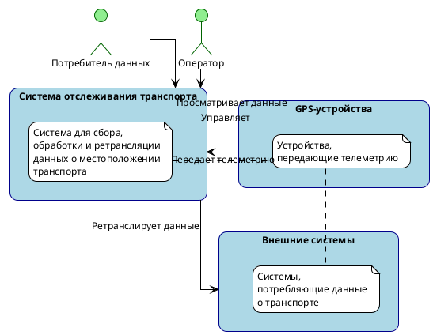
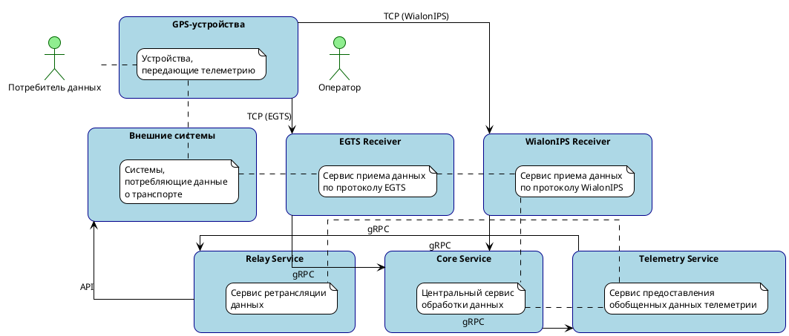

# Архитектура системы в формате C4

## Контекстная диаграмма (C4 Level 1)



## Диаграмма контейнеров (C4 Level 2)



## Диаграмма компонентов (C4 Level 3)

```plantuml
@startuml
!theme plain
skinparam linetype ortho
skinparam backgroundColor white
skinparam defaultFontName Arial
skinparam defaultFontSize 12
skinparam roundcorner 20
skinparam shadowing false

skinparam rectangle {
    BackgroundColor LightBlue
    BorderColor DarkBlue
    FontColor Black
}

skinparam component {
    BackgroundColor LightYellow
    BorderColor DarkYellow
    FontColor Black
}

rectangle "EGTS Receiver" {
    component "TCP Server" as egts_tcp {
        note right: Прием TCP соединений
    }
    component "EGTS Parser" as egts_parser {
        note right: Парсинг EGTS протокола
    }
    component "GPS Converter" as egts_converter {
        note right: Конвертация в общий формат
    }
    component "gRPC Client" as egts_grpc {
        note right: Отправка данных в Core Service
    }
}

rectangle "WialonIPS Receiver" {
    component "TCP Server" as wialon_tcp {
        note right: Прием TCP соединений
    }
    component "Wialon Parser" as wialon_parser {
        note right: Парсинг WialonIPS протокола
    }
    component "GPS Converter" as wialon_converter {
        note right: Конвертация в общий формат
    }
    component "gRPC Client" as wialon_grpc {
        note right: Отправка данных в Core Service
    }
}

rectangle "Core Service" {
    component "gRPC Server" as core_grpc_in {
        note right: Прием данных от ресиверов
    }
    component "Data Processor" as processor {
        note right: Обработка и обогащение данных
    }
    component "Route Matcher" as matcher {
        note right: Сопоставление с маршрутами
    }
    component "Schedule Validator" as validator {
        note right: Проверка расписания
    }
    component "gRPC Client" as core_grpc_out {
        note right: Отправка данных в Telemetry Service
    }
}

rectangle "Telemetry Service" {
    component "gRPC Server" as telemetry_grpc_in {
        note right: Прием данных от Core Service
    }
    component "Data Aggregator" as aggregator {
        note right: Агрегация данных от разных источников
    }
    component "Data Normalizer" as normalizer {
        note right: Нормализация данных в общий формат
    }
    component "gRPC Server" as telemetry_grpc_out {
        note right: Предоставление данных Relay Service
    }
}

rectangle "Relay Service" {
    component "gRPC Client" as relay_grpc {
        note right: Получение данных от Telemetry Service
    }
    component "Data Transformer" as transformer {
        note right: Преобразование данных
    }
    component "API Server" as api {
        note right: Предоставление API для внешних систем
    }
}

egts_tcp --> egts_parser : Сырые данные
egts_parser --> egts_converter : Распарсенные данные
egts_converter --> egts_grpc : GPS данные
egts_grpc --> core_grpc_in : gRPC

wialon_tcp --> wialon_parser : Сырые данные
wialon_parser --> wialon_converter : Распарсенные данные
wialon_converter --> wialon_grpc : GPS данные
wialon_grpc --> core_grpc_in : gRPC

core_grpc_in --> processor : GPS данные
processor --> matcher : Обработанные данные
matcher --> validator : Данные с маршрутом
validator --> core_grpc_out : Валидированные данные
core_grpc_out --> telemetry_grpc_in : gRPC

telemetry_grpc_in --> aggregator : Данные от Core Service
aggregator --> normalizer : Агрегированные данные
normalizer --> telemetry_grpc_out : Нормализованные данные
telemetry_grpc_out --> relay_grpc : gRPC

relay_grpc --> transformer : Данные от Telemetry Service
transformer --> api : Преобразованные данные

@enduml
```

## Описание компонентов

### EGTS Receiver
- **TCP Server**: Принимает TCP соединения от GPS-устройств, использующих протокол EGTS
- **EGTS Parser**: Парсит данные в формате EGTS
- **GPS Converter**: Конвертирует данные в общий формат GPS с указанием источника
- **gRPC Client**: Отправляет данные в Core Service

### WialonIPS Receiver
- **TCP Server**: Принимает TCP соединения от GPS-устройств, использующих протокол WialonIPS
- **Wialon Parser**: Парсит данные в формате WialonIPS
- **GPS Converter**: Конвертирует данные в общий формат GPS с указанием источника
- **gRPC Client**: Отправляет данные в Core Service

### Core Service
- **gRPC Server**: Принимает данные от ресиверов
- **Data Processor**: Обрабатывает и обогащает данные
- **Route Matcher**: Сопоставляет данные с маршрутами
- **Schedule Validator**: Проверяет соответствие расписанию
- **gRPC Client**: Отправляет данные в Telemetry Service

### Telemetry Service
- **gRPC Server**: Принимает данные от Core Service
- **Data Aggregator**: Агрегирует данные от разных источников
- **Data Normalizer**: Нормализует данные в общий формат
- **gRPC Server**: Предоставляет данные Relay Service

### Relay Service
- **gRPC Client**: Получает данные от Telemetry Service
- **Data Transformer**: Преобразует данные в формат для внешних систем
- **API Server**: Предоставляет API для внешних систем

## Протоколы и форматы данных

### Входящие протоколы
- EGTS (TCP)
- WialonIPS (TCP)

### Внутренние протоколы
- gRPC (между сервисами)
- Общий формат GPS данных
- Общий формат телеметрии

### Исходящие протоколы
- REST API (для внешних систем) 